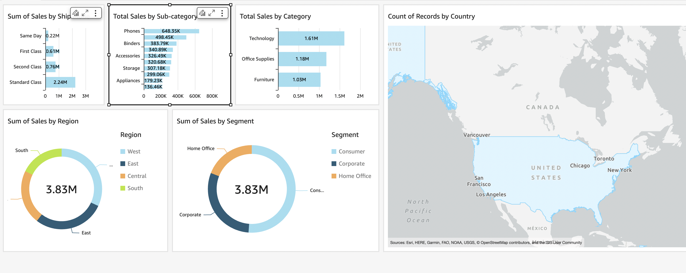

# AWS Learning Summary

## Introduction

In this document, I summarize my learning experience with basic AWS services. This includes an overview of the key AWS services I've explored and an example of data visualization using AWS QuickSight.

## AWS Services Explored

- **Amazon S3**: Used for scalable object storage.
- **AWS Athena**: Query service for S3 data.
- **AWS Glue**: Data cataloging and ETL service.
- **AWS IAM**: Identity and Access Management for secure access control.
- **AWS QuickSight**: Business intelligence service for creating visualizations and dashboards.

## AWS QuickSight Visualization

As part of my learning, I created a data visualization using AWS QuickSight. Below is a screenshot of the chart I created:

## Key Learnings

- **Data Storage and Management**: How to use S3 for data storage and Athena for querying.
- **ETL Processes**: Implementing ETL pipelines with AWS Glue.
- **Visualization**: Creating interactive and insightful visualizations with QuickSight.
- **Security**: Managing permissions and access using IAM.

## Contact

---

Thank you for reviewing my AWS learning summary!

